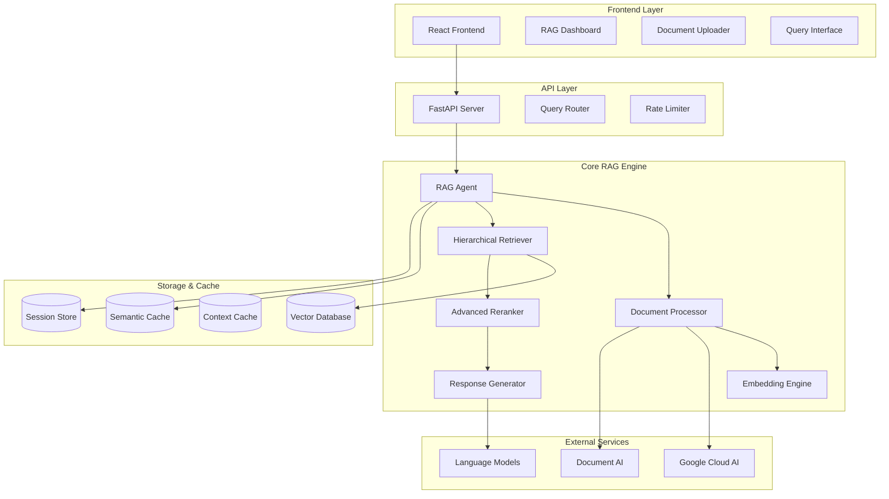

# RAG-ADK: Advanced Retrieval-Augmented Generation Development Kit

## Table of Contents

- [Overview](#overview)
- [Features](#features) 
- [Architecture](#architecture)
- [Project Structure](#project-structure)
- [Installation & Setup](#installation--setup)
- [Configuration](#configuration)
- [Core Components](#core-components)
- [API Reference](#api-reference)
- [Frontend Interface](#frontend-interface)
- [Examples & Usage](#examples--usage)
- [Optimization Features](#optimization-features)
- [Testing](#testing)
- [Deployment](#deployment)
- [Dependencies](#dependencies)
- [Contributing](#contributing)
- [License](#license)

## Overview

RAG-ADK (Retrieval-Augmented Generation - Advanced Development Kit) is a comprehensive, production-ready framework for building sophisticated RAG (Retrieval-Augmented Generation) applications. This toolkit provides advanced features including multi-modal processing, hierarchical search, semantic caching, and intelligent reranking to deliver high-performance AI-powered document retrieval and question-answering systems.

### Key Capabilities

- **Advanced RAG Pipeline**: Complete end-to-end retrieval-augmented generation workflow
- **Multi-Modal Support**: Process text, images, and other document types
- **Intelligent Caching**: Context-aware semantic caching and rate limiting
- **Hierarchical Search**: Multi-hop retrieval with advanced query decomposition
- **Real-time Processing**: Fast, scalable document processing and indexing
- **Production Ready**: Comprehensive testing, optimization, and deployment tools

## Features

### Core Features
- **Semantic Search**: Advanced vector-based document retrieval using state-of-the-art embeddings
- **Multi-Modal Processing**: Handle text, PDF, images, and structured documents
- **Intelligent Reranking**: Multiple reranking strategies including ColBERT and cross-encoder models
- **Context Caching**: Semantic-aware caching system to reduce API calls and improve performance
- **Query Optimization**: Query decomposition, rewriting, and routing for better results
- **Session Management**: Persistent conversation context and memory management

### Advanced Features
- **Hierarchical Search**: Multi-level document organization and retrieval
- **Citation Verification**: Automatic source verification and citation generation
- **Answer Verification**: Quality assurance for generated responses
- **Rate Limiting**: Intelligent API rate limiting and throttling
- **Vector Quantization**: Optimized storage and retrieval of embeddings
- **Evaluation Framework**: Built-in evaluation using RAGAS metrics

### Integration Features
- **Multiple Vector Stores**: Support for LanceDB, Qdrant, ChromaDB, and FAISS
- **Cloud Integration**: Google Cloud AI Platform and Document AI support
- **API Server**: RESTful API with FastAPI backend
- **React Frontend**: Modern web interface for document management and querying
- **Docker Support**: Containerized deployment with Docker Compose

## Architecture



### System Components

1. **Frontend Layer**: React-based web interface for user interactions
2. **API Layer**: FastAPI-powered RESTful service with authentication and rate limiting
3. **RAG Engine**: Core processing pipeline with advanced retrieval and generation
4. **Storage Layer**: Multiple vector database options with intelligent caching
5. **External Integrations**: Cloud AI services and language model providers

## Project Structure

```
RAG-ADK/
├── 📁 frontend/                    # React frontend application
│   ├── 📁 src/
│   │   ├── 📁 components/         # React components
│   │   │   ├── CorpusManager.tsx
│   │   │   ├── DocumentUploader.tsx
│   │   │   ├── QueryInterface.tsx
│   │   │   └── RAGDashboard.tsx
│   │   ├── 📁 services/           # API service layer
│   │   └── 📁 types/              # TypeScript type definitions
│   └── package.json
├── 📁 rag_agent/                  # Core RAG engine
│   ├── 📁 agents/                 # Agent implementations
│   │   └── root_agent.py
│   ├── 📁 core/                   # Core RAG components
│   │   ├── answer_verifier.py
│   │   ├── cache_manager.py
│   │   ├── citation_verification.py
│   │   ├── colbert_retrieval.py
│   │   ├── context_cache.py
│   │   ├── document_processor.py
│   │   ├── embeddings.py
│   │   ├── hierarchical_search.py
│   │   ├── indexing.py
│   │   ├── local_rag_store.py
│   │   ├── multihop_retrieval.py
│   │   ├── multimodal_processor.py
│   │   ├── query_decomposer.py
│   │   ├── query_rewriter.py
│   │   ├── query_router.py
│   │   ├── ragas_evaluation.py
│   │   ├── rate_limiter.py
│   │   ├── reranking.py
│   │   ├── retrieval.py
│   │   ├── semantic_cache.py
│   │   ├── semantic_chunker.py
│   │   ├── session_manager.py
│   │   └── vector_quantization.py
│   ├── 📁 optimization/           # Performance optimizations
│   │   ├── caching.py
│   │   └── context_pruning.py
│   └── 📁 tools/                  # Utility tools
│       ├── add_data.py
│       ├── create_corpus.py
│       ├── delete_corpus.py
│       ├── get_corpus_info.py
│       ├── list_corpora.py
│       └── rag_query.py
├── 📁 docs/                       # Documentation
│   ├── advanced_reranking.md
│   ├── context_caching_guide.md
│   └── embedding_configuration.md
├── 📁 examples/                   # Usage examples
│   └── optimized_rag_example.py
├── api_server.py                  # FastAPI server
├── main.py                        # Main application entry
├── enhanced_lancedb_config.py     # Database configuration
├── docker-compose.yml             # Docker deployment
├── requirements.txt               # Python dependencies
└── README.md                      # Project documentation
```

## Installation & Setup

### Prerequisites

- Python 3.8+
- Node.js 16+ (for frontend)
- Docker & Docker Compose (optional)
- GPU support recommended for optimal performance

### Quick Start

1. **Clone the repository:**
   ```bash
   git clone https://github.com/vedantparmar12/RAG-ADK.git
   cd RAG-ADK
   ```

2. **Install Python dependencies:**
   ```bash
   pip install -r requirements.txt
   ```

3. **Set up environment variables:**
   ```bash
   cp .env.example .env
   # Edit .env with your API keys and configuration
   ```

4. **Start the backend:**
   ```bash
   python main.py
   ```

5. **Install and start frontend:**
   ```bash
   cd frontend
   npm install
   npm start
   ```

### Docker Deployment

```bash
docker-compose up -d
```

This will start:
- Backend API server (port 8000)
- Frontend application (port 3000)
- Vector database services
- Caching layer

## Configuration

### Environment Variables

Create a `.env` file with the following configuration:

```env
# API Configuration
API_HOST=0.0.0.0
API_PORT=8000
DEBUG_MODE=false

# Database Configuration
VECTOR_DB_TYPE=lancedb
LANCEDB_PATH=./vector_db
QDRANT_URL=http://localhost:6333
CHROMADB_PATH=./chroma_db

# AI Model Configuration
OPENAI_API_KEY=your_openai_key
GOOGLE_API_KEY=your_google_key
HUGGINGFACE_API_KEY=your_hf_key

# Embedding Models
DEFAULT_EMBEDDING_MODEL=sentence-transformers/all-mpnet-base-v2
MULTIMODAL_EMBEDDING_MODEL=clip-ViT-B-32

# Cache Configuration
REDIS_URL=redis://localhost:6379
CACHE_TTL=3600
ENABLE_SEMANTIC_CACHE=true

# Performance Settings
MAX_CONCURRENT_REQUESTS=10
BATCH_SIZE=32
CHUNK_SIZE=512
OVERLAP_SIZE=50
```

### Advanced Configuration

For detailed configuration options, see the configuration files:
- `enhanced_lancedb_config.py` - Vector database settings
- `rag_agent/config.py` - Core RAG configuration

## Core Components

### 1. Document Processor
Handles multi-format document ingestion and preprocessing:

```python
from rag_agent.core.document_processor import DocumentProcessor

processor = DocumentProcessor()
documents = processor.process_files(file_paths=['doc1.pdf', 'doc2.txt'])
```

### 2. Embedding Engine
Generates and manages vector embeddings:

```python
from rag_agent.core.embeddings import EmbeddingManager

embeddings = EmbeddingManager(model_name="all-mpnet-base-v2")
vectors = embeddings.encode(texts)
```

### 3. Hierarchical Retriever
Advanced multi-level document retrieval:

```python
from rag_agent.core.hierarchical_search import HierarchicalSearchEngine

search_engine = HierarchicalSearchEngine()
results = search_engine.search(query, num_results=10)
```

### 4. Semantic Cache
Intelligent caching system:

```python
from rag_agent.core.semantic_cache import SemanticCache

cache = SemanticCache()
cached_result = cache.get(query)
if not cached_result:
    result = generate_response(query)
    cache.set(query, result)
```

### 5. Advanced Reranker
Multiple reranking strategies:

```python
from rag_agent.core.reranking import AdvancedReranker

reranker = AdvancedReranker(strategy="colbert")
reranked_results = reranker.rerank(query, retrieved_docs)
```

## API Reference

### REST Endpoints

#### Document Management

**POST /api/upload**
- Upload and process documents
- Parameters: `files`, `corpus_name`
- Returns: `{"status": "success", "processed_count": N}`

**GET /api/corpora**
- List all available document corpora
- Returns: `{"corpora": [...]}`

**DELETE /api/corpus/{corpus_name}**
- Delete a document corpus
- Returns: `{"status": "deleted"}`

#### Query Operations

**POST /api/query**
- Perform RAG query
- Parameters: `query`, `corpus_name`, `num_results`
- Returns: `{"answer": "...", "sources": [...], "confidence": 0.95}`

**POST /api/query/advanced**
- Advanced query with custom parameters
- Parameters: `query`, `retrieval_strategy`, `reranking_method`
- Returns: Enhanced response with metadata

#### System Operations

**GET /api/health**
- System health check
- Returns: `{"status": "healthy", "version": "1.0.0"}`

**GET /api/stats**
- System statistics
- Returns: Document counts, cache statistics, performance metrics

### Python SDK

```python
from rag_agent import RAGAgent

# Initialize agent
agent = RAGAgent(config_path="config.yaml")

# Add documents
agent.add_documents(corpus_name="knowledge_base", files=["doc1.pdf"])

# Query
result = agent.query("What is machine learning?", corpus_name="knowledge_base")
print(result.answer)
print(result.sources)
```

## Frontend Interface

### Components Overview

1. **RAG Dashboard** (`RAGDashboard.tsx`)
   - Main application dashboard
   - System overview and statistics
   - Navigation to other components

2. **Document Uploader** (`DocumentUploader.tsx`)
   - Drag-and-drop file upload
   - Batch processing support
   - Progress tracking and status updates

3. **Corpus Manager** (`CorpusManager.tsx`)
   - Create, view, and manage document collections
   - Corpus statistics and metadata
   - Document organization tools

4. **Query Interface** (`QueryInterface.tsx`)
   - Interactive query submission
   - Real-time response generation
   - Source citation and verification

### Usage Examples

#### Basic Query
```typescript
const query = "What are the benefits of renewable energy?";
const response = await ragService.query({
  query,
  corpusName: "environmental_docs",
  numResults: 5
});
```

#### Document Upload
```typescript
const files = [file1, file2, file3];
const result = await ragService.uploadDocuments({
  files,
  corpusName: "new_corpus"
});
```

## Examples & Usage

### Basic RAG Pipeline

```python
from rag_agent import RAGAgent
from rag_agent.core.document_processor import DocumentProcessor

# Initialize components
agent = RAGAgent()
processor = DocumentProcessor()

# Process documents
documents = processor.process_files([
    "research_paper.pdf",
    "technical_manual.docx",
    "knowledge_base.txt"
])

# Create corpus
corpus_id = agent.create_corpus(
    name="technical_knowledge",
    documents=documents
)

# Query the system
result = agent.query(
    query="Explain the technical specifications",
    corpus_name="technical_knowledge",
    num_results=5
)

print(f"Answer: {result.answer}")
print(f"Sources: {[source.filename for source in result.sources]}")
print(f"Confidence: {result.confidence}")
```

### Advanced Query with Custom Configuration

```python
from rag_agent.agents.root_agent import RootAgent
from rag_agent.core.reranking import RerankingStrategy

# Initialize with custom configuration
agent = RootAgent(config={
    "embedding_model": "sentence-transformers/all-mpnet-base-v2",
    "reranking_strategy": RerankingStrategy.COLBERT,
    "max_results": 10,
    "similarity_threshold": 0.7
})

# Advanced query
result = agent.advanced_query(
    query="Compare machine learning algorithms for time series",
    corpus_name="ml_research",
    query_expansion=True,
    multi_hop_retrieval=True,
    enable_citation_verification=True
)

# Access detailed results
print(f"Main Answer: {result.primary_answer}")
print(f"Related Topics: {result.related_queries}")
print(f"Verified Citations: {result.verified_sources}")
```

### Multi-Modal Processing

```python
from rag_agent.core.multimodal_processor import MultiModalProcessor

# Process mixed content
processor = MultiModalProcessor()
mixed_documents = processor.process_multimodal_batch([
    {"type": "pdf", "path": "report.pdf"},
    {"type": "image", "path": "chart.png", "caption": "Sales data"},
    {"type": "text", "content": "Additional context..."}
])

# Query with multi-modal context
result = agent.query(
    query="What does the sales chart show?",
    corpus_name="business_data",
    include_visual_context=True
)
```

## Optimization Features

### Performance Optimizations

1. **Context Caching**
   - Semantic-aware response caching
   - TTL-based cache expiration
   - Memory-efficient storage

2. **Vector Quantization**
   - Reduced memory footprint
   - Faster similarity search
   - Configurable precision trade-offs

3. **Batch Processing**
   - Efficient document processing
   - Parallel embedding generation
   - Optimized I/O operations

4. **Query Optimization**
   - Query rewriting and expansion
   - Intelligent routing
   - Result deduplication

### Configuration Examples

```python
# Enable optimizations
config = {
    "cache": {
        "enabled": True,
        "semantic_similarity_threshold": 0.85,
        "max_cache_size": "1GB"
    },
    "quantization": {
        "enabled": True,
        "precision": "int8",
        "compression_ratio": 0.25
    },
    "batch_processing": {
        "batch_size": 32,
        "max_workers": 4,
        "memory_limit": "2GB"
    }
}

agent = RAGAgent(optimization_config=config)
```

## Testing

### Running Tests

```bash
# Run all tests
python -m pytest

# Run specific test categories
python -m pytest tests/unit/
python -m pytest tests/integration/
python -m pytest tests/performance/

# Run with coverage
python -m pytest --cov=rag_agent
```

### Test Files

- `test_setup.py` - Basic setup and configuration tests
- `test_optimizations.py` - Performance optimization tests
- Custom test suites for each component

### Evaluation Framework

```python
from rag_agent.core.ragas_evaluation import RAGASEvaluator

# Initialize evaluator
evaluator = RAGASEvaluator()

# Evaluate system performance
metrics = evaluator.evaluate(
    queries=test_queries,
    ground_truths=expected_answers,
    contexts=retrieved_contexts
)

print(f"Faithfulness: {metrics.faithfulness}")
print(f"Answer Relevancy: {metrics.answer_relevancy}")
print(f"Context Precision: {metrics.context_precision}")
```

## Deployment

### Production Deployment

1. **Environment Setup**
   ```bash
   # Production environment
   export ENVIRONMENT=production
   export DEBUG_MODE=false
   export LOG_LEVEL=info
   ```

2. **Database Configuration**
   ```bash
   # Use production vector database
   export VECTOR_DB_TYPE=qdrant
   export QDRANT_URL=https://your-qdrant-cluster.com
   ```

3. **Scaling Configuration**
   ```bash
   # Performance tuning
   export MAX_WORKERS=8
   export BATCH_SIZE=64
   export CACHE_SIZE=2GB
   ```

### Docker Production Setup

```yaml
version: '3.8'
services:
  rag-api:
    build: .
    ports:
      - "8000:8000"
    environment:
      - ENVIRONMENT=production
      - REDIS_URL=redis://redis:6379
    depends_on:
      - redis
      - qdrant
    
  rag-frontend:
    build: ./frontend
    ports:
      - "80:80"
    depends_on:
      - rag-api
      
  redis:
    image: redis:alpine
    ports:
      - "6379:6379"
      
  qdrant:
    image: qdrant/qdrant
    ports:
      - "6333:6333"
    volumes:
      - ./qdrant_data:/qdrant/storage
```

### Kubernetes Deployment

```yaml
apiVersion: apps/v1
kind: Deployment
metadata:
  name: rag-adk
spec:
  replicas: 3
  selector:
    matchLabels:
      app: rag-adk
  template:
    metadata:
      labels:
        app: rag-adk
    spec:
      containers:
      - name: rag-api
        image: rag-adk:latest
        ports:
        - containerPort: 8000
        env:
        - name: REDIS_URL
          value: "redis://redis-service:6379"
```

## Dependencies

### Core Dependencies

**Python Backend:**
- `fastapi` - Web framework for API development
- `uvicorn` - ASGI server for production deployment
- `pydantic` - Data validation and settings management
- `transformers[torch]` - Transformer models and tokenizers
- `sentence-transformers` - Sentence embedding models
- `torch` - PyTorch deep learning framework

**Vector Databases:**
- `qdrant-client` - Qdrant vector database client
- `chromadb` - ChromaDB vector database
- `faiss-cpu/faiss-gpu` - Facebook AI Similarity Search
- Custom LanceDB integration

**AI/ML Libraries:**
- `google-generativeai` - Google Gemini API integration
- `google-genai` - Google AI Platform client
- `langchain` - LLM application framework
- `ragas` - RAG evaluation framework
- `colbert-ai` - ColBERT retrieval models

**Optimization:**
- `redis` - Caching and session storage
- `prometheus-client` - Metrics and monitoring
- `accelerate` - Model acceleration
- `quantize-embeddings` - Vector quantization

**Frontend (Node.js):**
- `react` - Frontend framework
- `typescript` - Type-safe JavaScript
- `@types/react` - TypeScript definitions
- Additional React ecosystem packages

### Security Dependencies
- Rate limiting libraries
- Input validation frameworks
- Secure configuration management

## Contributing

### Development Setup

1. **Fork and clone the repository**
2. **Create a virtual environment:**
   ```bash
   python -m venv venv
   source venv/bin/activate  # On Windows: venv\Scripts\activate
   ```

3. **Install development dependencies:**
   ```bash
   pip install -r requirements-dev.txt
   ```

4. **Run tests to ensure everything works:**
   ```bash
   python -m pytest
   ```

### Contribution Guidelines

- Follow PEP 8 style guidelines
- Add tests for new functionality
- Update documentation for API changes
- Submit pull requests with clear descriptions
- Ensure all tests pass before submission

### Code Structure

- **Core Logic**: `rag_agent/core/`
- **API Endpoints**: `api_server.py`
- **Frontend Components**: `frontend/src/components/`
- **Tests**: `tests/`
- **Documentation**: `docs/`

## License

This project is licensed under the MIT License. See the LICENSE file for details.

---

**RAG-ADK** provides a comprehensive, production-ready solution for building advanced retrieval-augmented generation applications. With its modular architecture, extensive feature set, and optimization capabilities, it serves as an ideal foundation for enterprise-grade AI-powered document processing and question-answering systems.
